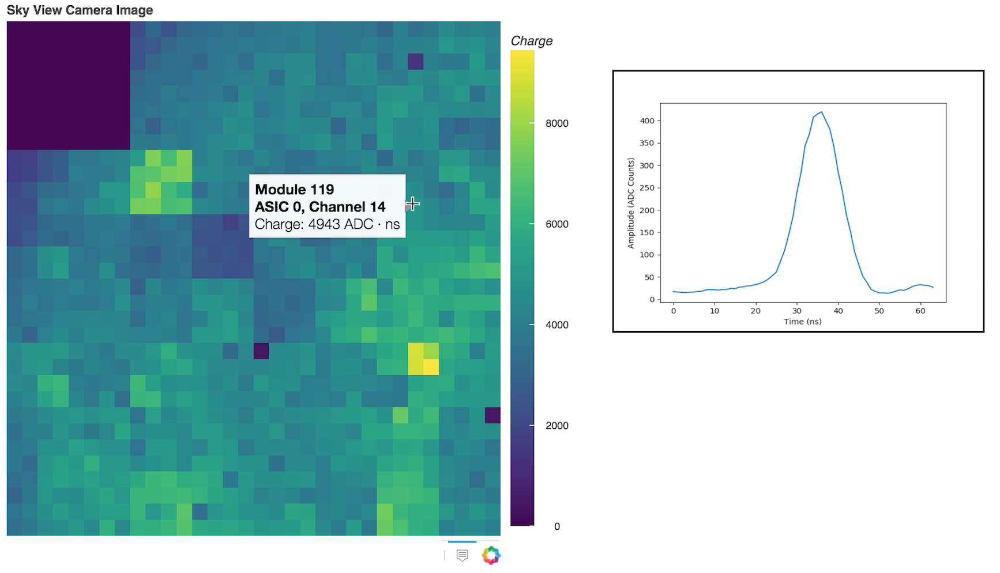

# Interactive-Heatmap
Python interactive heatmap implemented in Bokeh intended for visualizing full camera images for the [pSCT](http://cta-psct.physics.ucla.edu/). Rolling the mouse over each pixels displays module number, ASIC, channel, charge, and raw waveform.

Working example can be found here: [Interactive Heatmap](http://pymc-devs.github.io/pymc/). Screenshot shown below.


Working example can be found here: [Interactive Heatmap](http://pymc-devs.github.io/pymc/)

## Usage 
```bash
$ python make_interactive_heatmap.py ######
```
where "######" corresponds to the run number in a run######.h5 database created with the SCT toolkit
